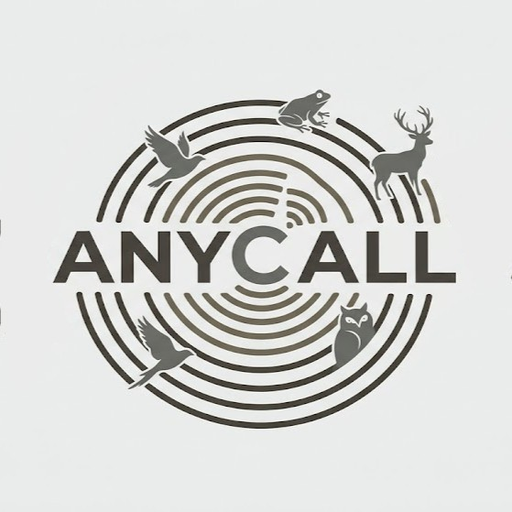

# AnyCall Mobile Field Station — Android Application

AnyCall Mobile is a dedicated Android application for **AnyCall: an open-set, few-shot, cross-taxa acoustic wildlife classifier**.



## Key Features

1. **GitHub DB Auto-Update Engine**:
   - Tap **"Update DB from GitHub"** to fetch the latest `anycall.db` (containing 53+ species vector prototypes) directly from the official GitHub repository (`https://raw.githubusercontent.com/techiitheblob/Anycall/main/anycall.db`).
   - Downloads over HTTPS with progress indicator, validates SQLite headers, and hot-swaps vector memory without app reinstallation.
2. **Mobile Microphone Field Recording**:
   - 1-tap 3-second audio recording with visual VU meter and waveform analysis.
   - Sub-second inference against the AnyCall Edge Station server.
3. **Enrolled Species Browser & Hide Unknowns Filter**:
   - Search through all 53 enrolled Indian fauna species (birds, frogs, insects, mammals).
   - Real-time detection stream with `Hide Unknowns` toggle.
4. **Android Native Launcher Branding**:
   - Custom app icon resources included under `android/app/src/main/res/mipmap-*`.

## Installation & Deployment

### Quick Local Preview
Serve the application using Python's HTTP server:
```bash
cd C:\Users\kahaa\teamwork_projects\anycall-android
python -m http.server 8080 --directory public
```
Open `http://localhost:8080` in Chrome on your Android device or PC to test or install as a PWA / TWA.

### Android Studio / APK Build
Import the project into Android Studio using the included `android/app/src/main/AndroidManifest.xml` and launcher mipmap icon assets.
